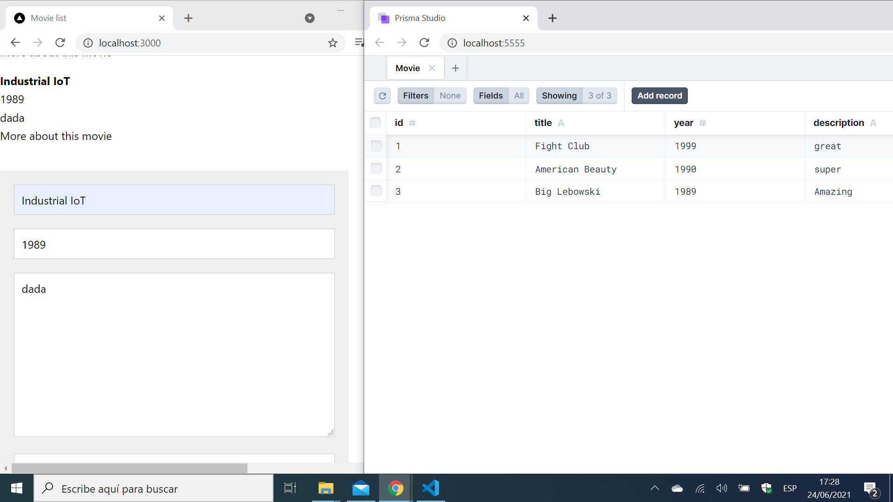

# :zap: Next Prisma Data

* Next.js React used with a Prisma database to display a simple data table
* **Note:** to open web links in a new window use: _ctrl+click on link_


## :page_facing_up: Table of contents

* [General info](#general-info)
* [Screenshots](#screenshots)
* [Technologies](#technologies)
* [Setup](#setup)
* [Features](#features)
* [Status](#status)
* [Inspiration](#inspiration)
* [Contact](#contact)

## :books: General info

* Full-stack app with Next React frontend and Prisma as the backend
* There is not a lot of styling - most aplied to the data entry form

## :camera: Screenshots



## :signal_strength: Technologies

* [Node.js v14](https://nodejs.org/) javascript runtime using the [Chrome V8 engine](https://v8.dev/).
* [React v17](https://reactjs.org/) Javascript library.
* [Next v10](https://nextjs.org/) minimalist framework for rendering react apps on the server.
* [Next with Apollo v5](https://www.npmjs.com/package/next-with-apollo) to save coding time
* [@prisma/client](https://www.npmjs.com/package/@prisma/client) auto-generated query builder that enables type-safe database access
* [Prisma Studio](https://www.prisma.io/studio)

## :floppy_disk: Setup

* Install dependencies using `npm i`
* `npm run dev` runs the Next app in the development mode. Open [http://localhost:3000](http://localhost:3000) to view it in the browser.
* `npx prisma studio` opens up a useful browser CLI for the Prisma database on `http://localhost:5555/`

## :wrench: Testing

* N/A

## :computer: Code Examples

* `pages/index.ts` async function to fetch all data from the Prisma database

```javascript
export async function getServerSideProps() {
	const movies = await prisma.movie.findMany();

	return {
		props: {
			data: movies,
		},
	};
}
```

## :cool: Features - Frontend

* The Prisma CLI browser interface is quite cool

## :clipboard: Status, Testing & To-Do List

* Status: Working
* To-Do: Change use of item.id as key in React list of films as it is not best practise. Could be developed with styled cards etc. on frontend to display data

## :clap: Inspiration/General Tools

* [Watch and Learn: Let's Checkout... Prisma & Next.js](https://www.youtube.com/watch?v=9qJKmesjTd8)

## :file_folder: License

* N/A

## :envelope: Contact

* Repo created by [ABateman](https://github.com/AndrewJBateman), email: gomezbateman@yahoo.com
